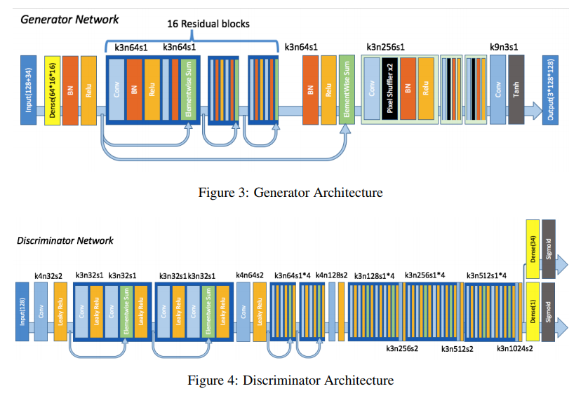
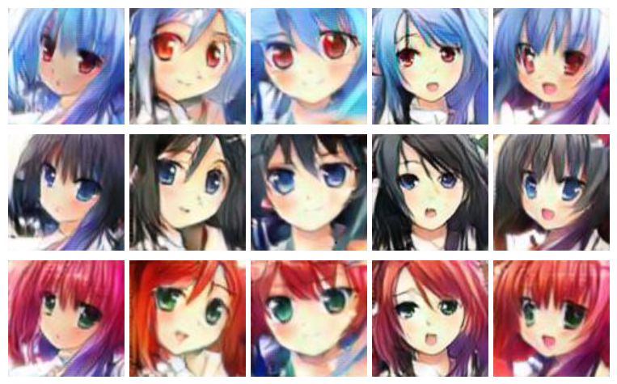

# Tensorflow-ACGAN-Anime-Generation
Tensorflow reimplementation of:

"Towards the Automatic Anime Characters Creation with Generative Adversarial Networks"
https://arxiv.org/abs/1708.05509

With the following modification:

* Replaced DRAGAN gradient penalty with Spectural spectural normalization.
* Removed the second term of Lcls. The fake image might confuse the classifier.

For more detail, please refer to the original paper.

Please download the training data from:

https://drive.google.com/open?id=1bXXeEzARYWsvUwbW3SA0meulCR3nIhDb

## Network Structure

## Results:

## Ref:

* https://github.com/m516825/Conditional-GAN
* https://arxiv.org/abs/1708.05509
* SRGAN : https://github.com/brade31919/SRGAN-tensorflow
* Spectural Normalization: https://github.com/minhnhat93/tf-SNDCGAN
* https://github.com/chang810249/tensorflow-generative-model-collections

